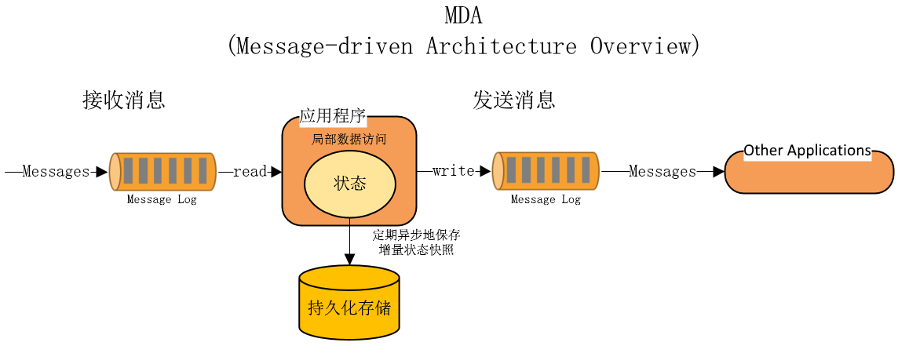

# MDA(devloping)
**Message Driven Architecture**

旨在让开发一个低延迟、高并发、高可用、基于消息驱动的响应式系统变得无比的简单。

**最简单、最本质的开发模式**
- 接收哪些类型的消息
- 发出哪些类型的消息

这就是你需要做的工作，就是这么简单，其他的事情，不用管，框架帮你搞定了，让你真正享受响应式DDD，仅仅处理领域问题！！！

**特性**
1. 低延迟

   运用Event souring技术使整个业务处理部分完全运行在内存中，保障业务状态变更只发生局部数据访问。

2. 高并发

   借鉴Actor model思想，使用[Disruptor](https://github.com/justmine66/Disruptor)分发高并发消息到业务处理器，单线程处理整个业务逻辑，从源头解决并发问题。

3. 高可用

   首先通过定期和异步地保存业务状态快照到远程持久化存储进行容错，然后再并行复制原始事件源数据到其他业务服务器，实时同步领域状态，当本机业务处理器宕机时，可以实现秒级切换。这不仅比基于最近快照副本重放最新事件源更快，而且也解决了单点故障的问题。

# 进度
目前正在为MDA开发高性能的消息分发组件[Distruptor](https://github.com/justmine66/Disruptor)，它是保障业务处理模块单线程执行，且完全运行于内存中的关键因素。

# 架构

