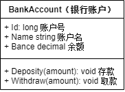

# 一、业务场景

> 将跟需求专家沟通的业务场景直挂地梳理出来。

电子银行又称网上银行、在线银行，它是各银行在互联网设置的虚拟柜台，利用网络技术，通过互联网向客户提供开户、存款、取款、转账等服务项目，使客户足不出户就能够安全、便捷地办理业务。

电子银行涉及的业务非常广，除了以上服务项目，还有销户、信贷、理财等业务，本应用作为示例，仅以银行基本交易为主线，比如：开户、存/取款、转账，一步步地讲解DDD建模，以及对比传统DDD和响应式DDD的区别。

## 1. 开户

从银行办理银行卡，即创建银行账户，可以选择存入初始余额。

## 2. 存款

向银行账户转入资金。

## 3. 取款

从银行账户转出资金。

## 4. 转账

将资金从付款账户划转到收款账户。

# 二、领域模型

> 根据业务场景梳理出领域概念以及之间的关联关系，提炼出通用语言。

## 1. 婴儿版

业务场景描述了用户要开展的具体业务行为，业务专家最擅长的叙述方式，这些都是业务需求最直观的体现。

行为描述的是业务过程，需要梳理出业务对象才能开展业务行为，根据信息专家模式：“将职责分配给拥有执行该职责所需信息的对象”，首先梳理出开展各个业务所需的信息，如下：

### 1.1. 开户

提供创建银行账户的信息，其实就是银行账户本身。

### 1.2. 存款

存款银行账户、存款金额。

### 1.3. 取款

取款银行账户、存款金额。

### 1.4. 转账

取款银行账户、取款金额。

存款银行账户、存款金额。

综上所述，提取出来的领域概念有，如下：

这样很容易就识别出了“**银行账户**”业务对象，开户、存款、取款都是以它为主体开展的，而转账本质也是由存款和付款两个行为组成，一个初步的业务模型就这样梳理出来了，如图所示：

### 1.5. 编程实现(伪代码)

